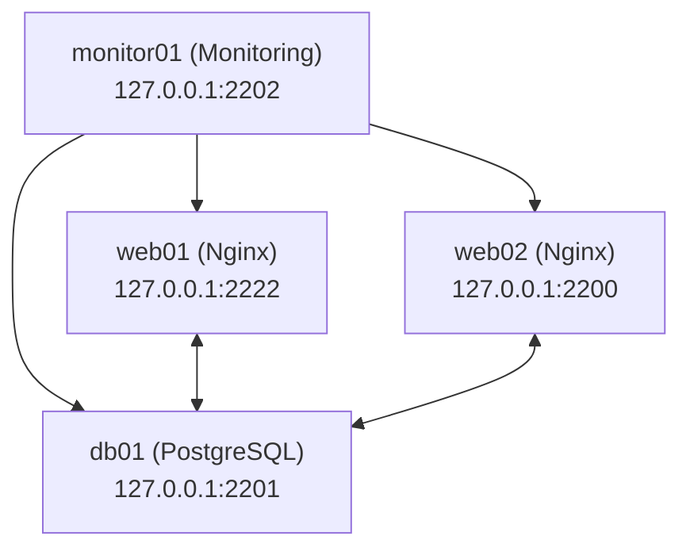

# Ansible DevOps Demo

A project to demonstrate Infrastructure as Code with Ansible, managing web servers, databases, and monitoring.

## Setup

### Prerequisites
- **Python 3**: For running Ansible.
- **Ansible**: To manage infrastructure.
- **Vagrant**: For local testing with virtual machines.
- **VirtualBox**: As the Vagrant provider.

### Installation
1. **Clone the Repository**:
   ```bash
   git clone https://github.com/Rick-Houser/ansible-devops-demo.git
   cd ansible-devops-demo
2. **Set up a Virtual Environment**:
    ```bash
    python3 -m venv ansible-devops-demo-venv
    source ansible-devops-demo-venv/bin/activate
3. **Install Dependencies**:
    ```bash
    pip install ansible
4. **Create a Vault Password File**:
    Create a file to store the vault password
    ```bash
    echo "mysecretpassword123" > .vault_pass.txt
    chmod 600 .vault_pass.txt
    ```
    Replace `mysecretpassword123` with a strong password.
5. **Start Vagrant VMs and Run the Playbook**:
    ```bash
    vagrant up
    ansible-playbook playbooks/site.yml
6. **Clean Up**:
    ```bash
    vagrant halt
    vagrant destroy -f

### Diagram
Below is a simple diagram of the infrastructure managed by this project:

* **web01**, **web02**: Web servers running Nginx.
* **db01**: Database server running PostgreSQL.
* **monitor01**: Monitoring server with basic tools like `htop`.